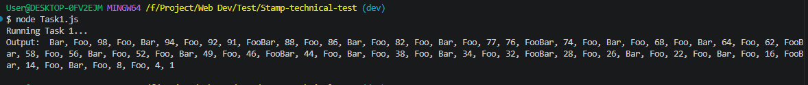
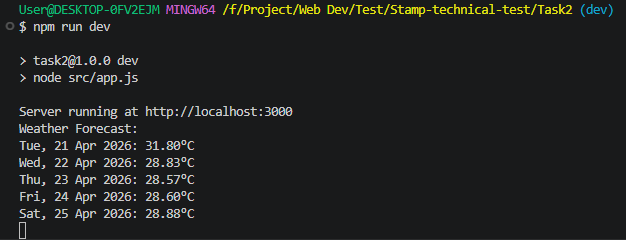
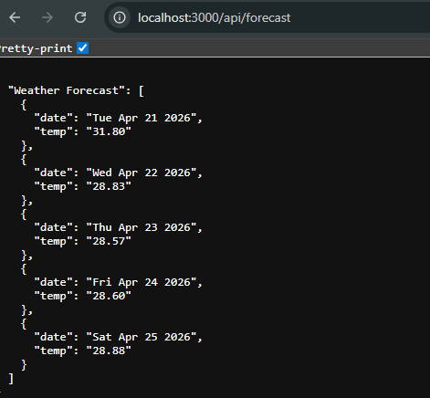

# stamps-technical-test

A technical test submission containing two tasks: a FizzBuzz variation program and a Jakarta weather forecast API built with **Express.js**.

---

## 🚀 Tasks Overview

### 1. Small Program

A logic sequence from **100 down to 1** with the following rules:

- **Reverse Order:** Iterates from 100 to 1.
- **Prime Filter:** Skips and does not print any prime numbers.
- **Logic:**
  - Replaces multiples of 3 with `"Foo"`.
  - Replaces multiples of 5 with `"Bar"`.
  - Replaces multiples of both 3 and 5 with `"FooBar"`.
- **Format:** Output is displayed horizontally.



### 2. Weather Forecast API

A REST API that fetches and displays the weather forecast for **Jakarta** for the next 5 days.

- **Source:** [OpenWeatherMap API](https://openweathermap.org/)
- **Constraint:** Displays exactly one temperature per day.
- **Security:** API Key is handled via environment variables — never hardcoded.

---

## ⚙️ How to Run

### Prerequisites

- Node.js **v18 or higher** (required for built-in `fetch`)
- A free API key from [OpenWeatherMap](https://home.openweathermap.org/users/sign_up)

### 1. Clone the repository

```bash
git clone https://github.com/faqih28alam/stamps-technical-test.git
cd Task2
```

### 2. Install dependencies

```bash
npm install
```

### 3. Set up environment variables

Create a `.env` file in the root directory:

```bash
cp .env.example .env
```

Then open `.env` and fill in your API key:

```env
Weather_API = https://api.openweathermap.org/data/2.5/weather?lat={lat}&lon={lon}&appid={API key}
```

> ⚠️ Never commit your `.env` file. It is already listed in `.gitignore`.

### 4. Run in development mode

```bash
npm run dev
```

The server will start at `http://localhost:3000`.


---

## 🌐 API Endpoints

| Method | Endpoint         | Description                          |
|--------|------------------|--------------------------------------|
| GET    | `/api/forecast`      | Fetch 5 Days Forcast |                        |

### Example: `GET /api/forecast`

```
Weather Forecast:
Fri, 23 Apr 2021: 16.72°C
Sat, 24 Apr 2021: 18.57°C
Sun, 25 Apr 2021: 22.35°C
Mon, 26 Apr 2021: 20.42°C
Tue, 27 Apr 2021: 23.46°C
```

---

## 📸 Screenshots

_Add screenshots of your terminal output or API response here._

---

